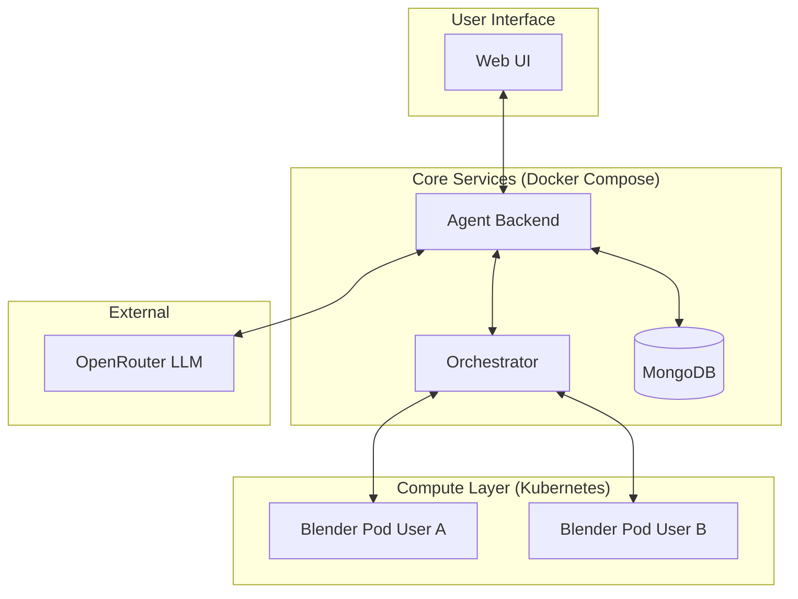
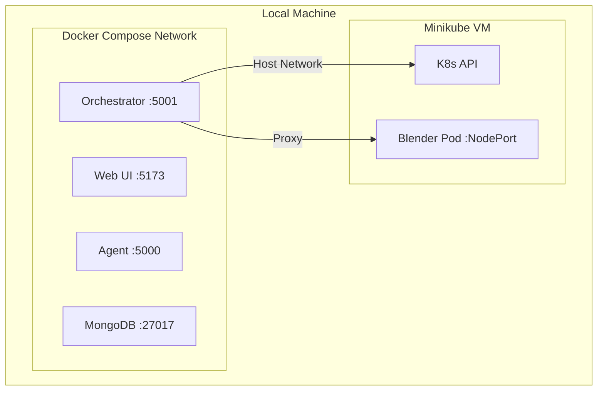
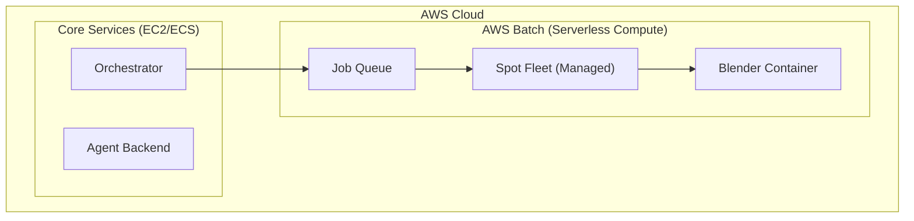
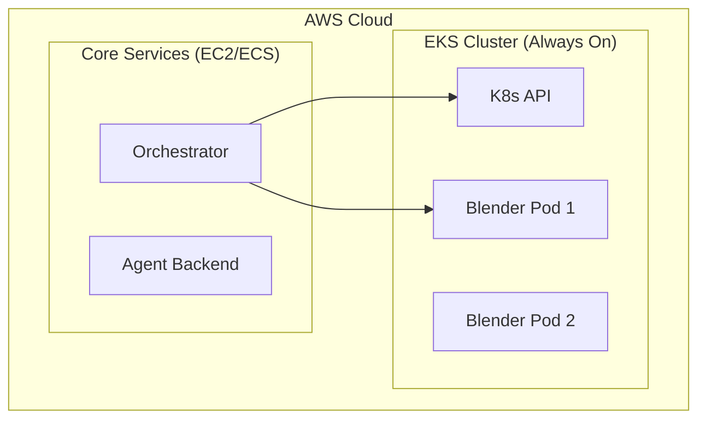
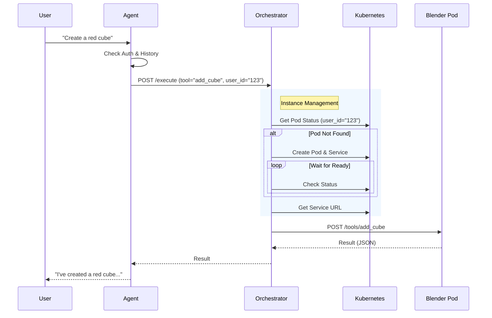

# 🎨 Blender AI Agent POC

A proof-of-concept system where an AI agent can interact with Blender to create 3D scenes using natural language. Built with the Model Context Protocol (MCP) for clean separation between the agent and Blender.

## 🏗️ Architecture

The system uses a hybrid architecture where core services run in Docker containers, while Blender instances are dynamically spawned as Kubernetes pods to ensure isolation and scalability.

### System Overview



### Components

1.  **Web UI** (`web-ui/`): React/Vite-based chat interface.
2.  **Agent Backend** (`agent/`): Flask server that manages conversation state, calls the LLM (OpenRouter), and routes tool execution requests.
3.  **Orchestrator** (`orchestrator/`): The bridge between the Agent and Kubernetes. It manages the lifecycle of Blender pods (spawn/despawn) and proxies requests to the correct instance.
4.  **Blender MCP Server** (`blender-mcp-server/`): A Dockerized Blender instance running an HTTP server that implements the Model Context Protocol. These are ephemeral and created on-demand.

---

## 🚀 Deployment Scenarios

### 1. Local Development (Current Setup)

In this setup, everything runs on your local machine. We use **Docker Compose** for the core services and **Minikube** to simulate a Kubernetes cluster for the Blender pods.



**Prerequisites:**
- Docker & Docker Compose
- Minikube (`minikube start --driver=docker`)
- Python 3.10+

**Start-up:**
1.  Start Minikube: `minikube start`
2.  Build & Load Image: `docker-compose --profile build up blender-image && minikube image load blender-mcp:latest`
3.  Start Services: `docker-compose up --build`

### 2. Cloud Deployment Options

For production, you have two main paths depending on your workload:

#### Option A: AWS Batch (Recommended for Sporadic Work)
Best for "on-demand" agents that only need to render occasionally.



- **How it works**: The Agent submits a job to a Queue. AWS Batch spins up an EC2 Spot Instance, runs the Blender container, and shuts it down immediately after.
- **Pros**: **Zero fixed costs**. You only pay for the seconds the computer is running.
- **Cons**: 2-3 minute "cold start" time while the instance boots.

#### Option B: AWS EKS (High Volume / Enterprise)
Best if you have 100+ users rendering constantly.



- **How it works**: A Kubernetes cluster keeps a fleet of nodes ready to accept tasks instantly.
- **Pros**: Instant start (no boot time). Standard industry orchestration.
- **Cons**: **Expensive fixed costs** ($72/month for the cluster control plane) even if idle.

---

### 3. Communication with AWS Batch (If using Option A)

If you choose AWS Batch, the Orchestrator communicates with the AWS API using `boto3`. However, before the Orchestrator can submit jobs, you need to set up the environment.

#### 1. Setup: Push Image to ECR
AWS Batch cannot pull images from your local machine. You must push the `blender-mcp` image to Amazon ECR (Elastic Container Registry).

```bash
# 1. Authenticate Docker to ECR
aws ecr get-login-password --region us-east-1 | docker login --username AWS --password-stdin <your-account-id>.dkr.ecr.us-east-1.amazonaws.com

# 2. Create a repository (if it doesn't exist)
aws ecr create-repository --repository-name blender-mcp

# 3. Tag your local image
docker tag blender-mcp:latest <your-account-id>.dkr.ecr.us-east-1.amazonaws.com/blender-mcp:latest

# 4. Push the image
docker push <your-account-id>.dkr.ecr.us-east-1.amazonaws.com/blender-mcp:latest
```

#### 2. Setup: Create Job Definition
In the AWS Console (or via CLI), create a **Job Definition**. This acts as a template for your jobs.
-   **Name**: `blender-mcp-job-def`
-   **Image**: `<your-account-id>.dkr.ecr.us-east-1.amazonaws.com/blender-mcp:latest`
-   **vCPUs**: 4 (or as needed)
-   **Memory**: 8192 (8GB)

#### 3. Runtime: Submit Job
Once the image is in ECR and the Job Definition is ready, the Orchestrator can submit jobs.

**How it works:**
1.  **Authentication**: Uses standard AWS credentials (IAM Role attached to the EC2 instance).
2.  **API Client**: The Python `boto3` library handles the job submission.

**Code Example (`orchestrator/batch_provider.py`):**

```python
import boto3

def submit_job(user_id):
    batch = boto3.client('batch')
    response = batch.submit_job(
        jobName=f'blender-render-{user_id}',
        jobQueue='blender-gpu-queue',
        jobDefinition='blender-mcp-job-def',
        containerOverrides={
            'environment': [{'name': 'USER_ID', 'value': user_id}]
        }
    )
    return response['jobId']
```

### 4. Communication with EKS (If using Option B)

If you choose EKS, the Orchestrator communicates with the cluster using the standard **Kubernetes API**.

**How it works:**
1.  **Authentication**: Uses a **Service Account** token mounted inside the Orchestrator pod.
2.  **API Client**: The Python `kubernetes` library handles the connection.

**Code Example (`orchestrator/k8s_provider.py`):**

```python
from kubernetes import client, config

def initialize_k8s():
    config.load_incluster_config() # Load EKS config
    v1 = client.CoreV1Api()
    v1.create_namespaced_pod(namespace="default", body=pod_manifest)
```

### 5. 💰 Cost Analysis & Comparison

| Feature | AWS Batch | AWS EKS |
| :--- | :--- | :--- |
| **Ideal Use Case** | Sporadic / Batch Jobs | Continuous High Traffic |
| **Fixed Monthly Cost** | **$0** | **~$72** (Cluster Fee) |
| **Compute Cost** | Pay per second | Pay per second + Idle time |
| **Startup Time** | Slow (mins) | Fast (ms) |

#### Scenario 1: "The Sporadic Agent"
Your agent needs to render a scene 5 times a day (20 mins each). Total: 100 mins/day.

- **AWS EKS**: $2.40 (Cluster) + $0.20 (Compute) = **$2.60 / day**
- **AWS Batch**: $0 (Cluster) + $0.20 (Compute) = **$0.20 / day**

**Verdict**: For sporadic workloads, **AWS Batch is ~13x cheaper** than EKS.

#### Scenario 2: "The Design Agency" (High Volume)
Your agency has 20 designers working 6 hours a day. They need instant feedback. Total: 120 hours/day.

- **AWS EKS**: $2.40 (Cluster) + $14.40 (Compute) = **$16.80 / day**
- **AWS Batch**: $0 (Cluster) + $14.40 (Compute) = **$14.40 / day**

**Verdict**: For high-volume workloads, the **$2.40/day premium for EKS** is negligible for the benefit of **instant startup times**.

---

## 🔄 Workflow: Blender Instance Spin-up

When a user asks to perform a 3D operation, the system ensures a Blender instance is available for them.



1.  **Request**: Agent receives a tool call from the LLM.
2.  **Delegation**: Agent calls the Orchestrator with the `user_id` and tool details.
3.  **Check**: Orchestrator queries K8s to see if a pod named `blender-{user_id}` exists.
4.  **Spawn (if needed)**:
    -   If no pod exists, Orchestrator requests K8s to create one.
    -   It waits for the pod to reach `Running` state and for the health check to pass.
5.  **Execution**: Once ready, Orchestrator forwards the tool call to the pod's HTTP server.
6.  **Response**: The result is bubbled back up to the user.

---

## 🛠️ Quick Start

### 1. Setup Minikube

```bash
minikube start --driver=docker
```

### 2. Build and Load Images

```bash
# Build the Blender MCP image
docker-compose --profile build up blender-image

# Load it into minikube so K8s can find it
minikube image load blender-mcp:latest
```

### 3. Start Services

```bash
docker-compose up --build
```

Access the UI at `http://localhost:5173`.

## 🔧 Configuration

-   **Agent**: `.env` (OpenRouter Key, DB URI)
-   **Orchestrator**: Environment variables in `docker-compose.yml` (Kubeconfig path)
-   **Web UI**: `VITE_AGENT_URL` in `docker-compose.yml`

## 🤝 Contributing

Feel free to open issues or PRs to improve the architecture or add new Blender capabilities!
